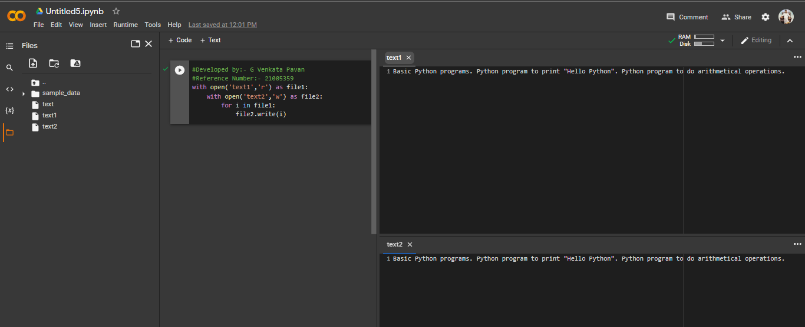

# copy-file
## AIM:
To write a python program for copying the contents from one file to another file.
## EQUIPEMENT'S REQUIRED: 
PC
Anaconda - Python 3.7
## ALGORITHM: 
### Step 1:
Start creating the python project for copying a file.

### Step 2:
Open the first file in read mode appropriate method.

### Step 3:
Open the second file in write mode by an appropriate method.

### Step 4:
Look until a variable 'i' in the first file.so variable i propagates all over the content.

### Step 5:
Write the value of 'i' in the second file by following method.SecondName.write(i).

### Step 6:
End the program.

## PROGRAM:
```python
#Developed by:- G Venkata Pavan
#Reference Number:- 21005359
with open('text1','r') as file1:
    with open('text2','w') as file2:
        for i in file1:
            file2.write(i)
```
### OUTPUT:

## RESULT:
Thus the program is written to copy the contents from one file to another file.